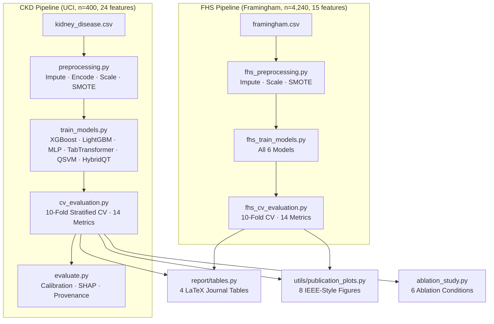
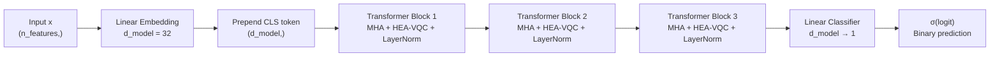

# Hybrid Quantum-Classical Transformer (HQCT)
### Four-Dataset Clinical Risk Stratification: CKD · PIMA · Cleveland · Framingham


> **Target venues:** Expert Systems with Applications · Applied Soft Computing · npj Quantum Information  
> A hardware-efficient hybrid quantum-classical architecture for medical tabular classification with a data-adaptive quantum circuit, cryptographic provenance, calibration, SHAP + quantum feature attribution, and full statistical rigor.

---

## Overview

This repository implements and evaluates five models across **four independent clinical datasets** using a rigorous 10-fold stratified cross-validation framework with per-fold SMOTE (no data leakage). The proposed **HybridQT** replaces the feed-forward sublayer of a TabTransformer with a **data-adaptive** Hardware-Efficient Ansatz (HEA) variational quantum circuit — circuit complexity (4–6 qubits, 2–3 layers) is selected per fold from the training-set size.

**Honest positioning:** HybridQT is *competitive*, not uniformly best. It leads on the small, balanced **Cleveland** benchmark (highest MCC, tied-best accuracy, lowest variance) and ranks 2nd by F1 on the imbalanced **FHS**, while trailing strong classical baselines on the near-saturated **CKD** and **PIMA**. The contribution is a viable, interpretable quantum-classical architecture with quantifiable circuit properties — not a universal accuracy win.

| Model | Type | Quantum |
|---|---|:---:|
| XGBoost | Classical gradient boosting | — |
| LightGBM | Classical gradient boosting | — |
| MLP | 2-layer neural network | — |
| TabTransformer | Classical attention-based tabular model | — |
| QSVM | Quantum kernel SVM | ⚛ |
| **HybridQT** | **Hybrid quantum-classical transformer ← proposed** | **⚛** |

---

## Quantum Novelty

### Hardware-Efficient Ansatz (HEA) — 6 Qubits, 3 Layers

The proposed VQC architecture uses a **Hardware-Efficient Ansatz** with data re-uploading, replacing the standard feed-forward sublayer in each Transformer block:

```
Qubit 0: ──RY(x₀)──RZ(θ₀)──●──────────────X──RY(x₀)──RZ(θ₆)── ...
Qubit 1: ──RY(x₁)──RZ(θ₁)──X──●────────────┼──RY(x₁)──RZ(θ₇)── ...
Qubit 2: ──RY(x₂)──RZ(θ₂)─────X──●─────────┼──RY(x₂)──RZ(θ₈)── ...
Qubit 3: ──RY(x₃)──RZ(θ₃)────────X──●──────┼──RY(x₃)──RZ(θ₉)── ...
Qubit 4: ──RY(x₄)──RZ(θ₄)───────────X──●───┼──RY(x₄)──RZ(θ₁₀)── ...
Qubit 5: ──RY(x₅)──RZ(θ₅)──────────────X───●──RY(x₅)──RZ(θ₁₁)── ...
```

- **6 qubits**, **3 layers**, **data re-uploading** at each layer
- **36 variational parameters** (2 rotations × 6 qubits × 3 layers)
- **Ring CNOT entanglement**: qubit i entangles with qubit (i+1) mod 6
- **Measurement**: ⟨Z⟩ expectation values on all 6 qubits → 6-dim classical output
- **Simulation**: `pennylane.device("default.qubit")` — pure-state classical simulation

### Quantum Circuit Metrics

| Metric | Value |
|--------|-------|
| Expressibility (Meyer-Wallach) | computed via `utils/quantum_metrics.py` |
| Entanglement capability (Q-measure) | computed via `utils/quantum_metrics.py` |
| Kernel Target Alignment (vs RBF) | computed via `utils/quantum_advantage.py` |
| Gate count | 72 rotations + 18 CNOTs per forward pass |
| Circuit depth | 3L × (2 single-qubit + 1 CNOT) = 9 layers |

---

## Architecture

### Full Pipeline



### HybridQT Model (6-Qubit HEA)



---

## Results

All numbers are from 10-fold stratified cross-validation (SMOTE applied inside
training folds only). HybridQT uses a **data-adaptive circuit** sized per fold to
the training-set size (4q-2L / 6q-2L / 6q-3L). **We report honest results: HybridQT
is competitive — leading on some datasets/metrics, trailing on others — not
uniformly best.** Reproduce with `python cv_evaluation.py` (and the `*_cv_evaluation.py`
scripts); regenerate this table from `results/*_cv_results.csv`.

### CKD — UCI Chronic Kidney Disease (n=400, saturated benchmark)

| Model | Accuracy | F1 | AUC-ROC | MCC |
|---|---|---|---|---|
| **MLP** | **99.75% ± 0.75%** | **0.9980** | **1.0000** | **0.9949** |
| TabTransformer | 99.50% ± 1.50% | 0.9960 | 0.9992 | 0.9893 |
| LightGBM | 99.25% ± 1.15% | 0.9940 | 0.9997 | 0.9845 |
| XGBoost | 99.00% ± 1.66% | 0.9919 | 0.9987 | 0.9796 |
| HybridQT (4q-2L) | 98.25% ± 1.95% | 0.9858 | 0.9963 | 0.9639 |

### PIMA — Indians Diabetes (n=768)

| Model | Accuracy | F1 | AUC-ROC | MCC |
|---|---|---|---|---|
| **MLP** | **76.68% ± 5.33%** | **0.6894** | **0.8471** | **0.5132** |
| XGBoost | 76.15% ± 4.82% | 0.6705 | 0.8262 | 0.4879 |
| TabTransformer | 75.90% ± 4.85% | 0.6703 | 0.8266 | 0.4857 |
| LightGBM | 75.38% ± 4.42% | 0.6608 | 0.8177 | 0.4711 |
| HybridQT (6q-2L) | 74.20% ± 5.53% | 0.6542 | 0.8132 | 0.4560 |

### Cleveland — Heart Disease (n=297) — *HybridQT leads*

| Model | Accuracy | F1 | AUC-ROC | MCC |
|---|---|---|---|---|
| **HybridQT (4q-2L)** | **83.15% ± 5.85%** | 0.8113 | 0.9096 | **0.6633** |
| TabTransformer | 83.15% ± 8.83% | **0.8171** | **0.9182** | 0.6632 |
| MLP | 82.15% ± 6.87% | 0.7979 | 0.8995 | 0.6457 |
| XGBoost | 81.84% ± 6.36% | 0.8018 | 0.8865 | 0.6410 |
| LightGBM | 80.10% ± 6.16% | 0.7800 | 0.8838 | 0.6120 |

> On Cleveland, HybridQT achieves the **highest MCC**, **tied-best accuracy**, and the **lowest accuracy variance** (±5.85% vs TabTransformer's ±8.83%) — the adaptive 4-qubit circuit suits this small, balanced dataset.

### FHS — Framingham Heart Study (n=4,240, class-imbalanced) — *HybridQT 2nd on F1*

| Model | Accuracy | F1 | AUC-ROC | MCC |
|---|---|---|---|---|
| **MLP** | 67.81% ± 2.19% | **0.3536** | 0.6933 | **0.2093** |
| HybridQT (6q-2L) | 78.33% ± 5.68% | 0.3157 | 0.6800 | 0.1974 |
| TabTransformer | 80.52% ± 2.55% | 0.2847 | 0.6919 | 0.1870 |
| XGBoost | 81.58% ± 1.85% | 0.2485 | 0.6672 | 0.1600 |
| LightGBM | 81.67% ± 1.43% | 0.2337 | 0.6681 | 0.1485 |

> On the imbalanced FHS task, F1 (minority-class recall/precision balance) is the clinically meaningful metric: HybridQT ranks **2nd of 5**, behind only MLP.

### Statistical Significance

Pairwise **Wilcoxon signed-rank**, **Friedman + Nemenyi** post-hoc, **DeLong** AUC tests,
and **bootstrap CIs** are computed per dataset (`results/*_statistical_tests.json`).
McNemar's exact test (HybridQT vs XGBoost) with full contingency tables is saved to
`results/*_mcnemar_detail.json`. On the saturated CKD benchmark the top models are not
significantly different (parity, not advantage).

---

## Cryptographic Provenance

Every dataset and model checkpoint is fingerprinted with SHA-256:

```python
from utils.integrity import compute_sha256, sign_model

# Dataset fingerprint
sha = compute_sha256("data/kidney_disease.csv")
# → logged to results/data_hashes.json

# Model provenance
record = sign_model("models/hybrid_qt.pt", metadata={...})
# → logged to results/provenance_log.json
# record contains: model_sha256, timestamp, python_version,
#                  library_versions, random_seeds, experiment_fingerprint
```

The combined **experiment fingerprint** (SHA-256 of all fields) uniquely identifies every training run. Verify integrity:

```bash
python scripts/sanity_check.py  # All checks must PASS
```

---

## Differential Privacy

The pipeline supports DP-SGD training via a manual implementation (no Opacus dependency):

```python
from utils.dp_training import DPOptimizer, privacy_report

dp_opt = DPOptimizer(base_optimizer, noise_multiplier=1.1, max_grad_norm=1.0)

report = privacy_report(epochs=50, batch_size=32, n_samples=400,
                        noise_multiplier=1.1, max_grad_norm=1.0, delta=1e-5)
# → {"epsilon": ..., "delta": 1e-5, "noise_multiplier": 1.1, "mechanism": "Gaussian"}
```

Enable with `python main.py --dp-train`. Privacy budget (ε, δ) is reported alongside accuracy.

---

## Installation

### Conda (Recommended)

```bash
conda env create -f environment.yml
conda activate hqct
```

### pip

```bash
pip install -r requirements.txt
```

### Docker

```bash
docker build -t hqct .
docker run -v $(pwd)/data:/workspace/data \
           -v $(pwd)/results:/workspace/results \
           hqct python main.py --skip-quantum
```

---

## Quick Start

```bash
# 1. Get datasets (PIMA + Cleveland + CKD auto-download; FHS needs manual CSV)
python preprocessing.py            # UCI CKD (auto)
python pima_preprocessing.py       # PIMA Indians Diabetes (auto)
python cleveland_preprocessing.py  # Cleveland Heart Disease (auto)
python fhs_preprocessing.py        # Framingham (needs data/framingham.csv)

# 2. Run all four datasets end-to-end (preprocess + CV + tables + figures)
python main.py --dataset all --skip-quantum   # fast (skips HybridQT/QSVM)
python main.py --dataset all                  # full (includes adaptive HybridQT)

#    ...or one dataset at a time:
python cv_evaluation.py --skip-qsvm            # CKD
python pima_cv_evaluation.py --skip-qsvm       # PIMA
python cleveland_cv_evaluation.py --skip-qsvm  # Cleveland
python fhs_cv_evaluation.py --skip-qsvm        # FHS

# 3. Run the analysis suite (quantum metrics, SHAP, calibration, ablation)
python scripts/run_quantum_analysis.py    # expressibility, entanglement, KTA, barren plateau
python scripts/run_calibration.py         # ECE/MCE + reliability diagrams (all datasets)
python scripts/run_explainability.py      # XGBoost SHAP + quantum feature attribution
python ablation_study.py --folds 5 --epochs 20

# 4. Generate publication outputs
python report/tables.py           # 4 LaTeX tables → results/latex_tables/
python report/paper_sections.py   # honest abstract + sections
python utils/publication_plots.py # 8 IEEE figures  → results/figures/

# 5. Verify
python scripts/sanity_check.py   # integrity checks
pytest tests/ -v                  # 45 tests must pass
```

### Key CLI Flags

| Flag | Pipeline | Description |
|---|---|---|
| `--skip-quantum` | main.py | Skip QSVM and HybridQT (much faster) |
| `--skip-preprocessing` | main.py | Reuse existing .npy files |
| `--epochs N` | main.py | Override training epochs (default: 50) |
| `--ablation` | main.py | Run 6-condition ablation study |
| `--fast` | main.py | Skip expensive quantum metrics |
| `--skip-qsvm` | cv_evaluation.py | Skip QSVM in CV (hours on CPU) |
| `--dp-train` | main.py | Enable differential privacy (DP-SGD) |

---

## Datasets

All four are auto-downloaded except FHS (manual). SHA-256 fingerprints of every
raw file are logged to `results/data_hashes.json`.

### CKD — UCI Chronic Kidney Disease
- Auto-downloaded from UCI ML Repository (id=336) by `preprocessing.py`
- n=400, 24 features, binary target `class` (ckd / notckd). Near-saturated benchmark.

### PIMA — Indians Diabetes
- Auto-downloaded by `pima_preprocessing.py` (public mirror)
- n=768, 8 numeric features, 35/65 imbalance, binary `Outcome`
- Physiologically-impossible zeros (glucose, BP, skin, insulin, BMI) treated as missing → median-imputed

### Cleveland — Heart Disease
- Auto-downloaded from UCI ML Repository by `cleveland_preprocessing.py`
- n=303 (297 after dropping 6 `?` rows), 13 features, ~54/46 balance
- Target binarized: disease present iff `num > 0`

### FHS — Framingham Heart Study
- Manual download from [Kaggle](https://www.kaggle.com/datasets/aasheesh200/framingham-heart-study-dataset)
- Place as: `data/framingham.csv`
- n=4,240, 15 features, binary target `TenYearCHD` (~85/15 imbalance)

---

## Output Files

```
results/
├── cv_results.csv                  CKD 10-fold CV (6 models × 14 metrics)
├── fhs_cv_results.csv              FHS 10-fold CV (6 models × 14 metrics)
├── full_metrics_ckd.csv            Per-fold expanded metrics (MCC, kappa, brier, AUC-PR...)
├── full_metrics_fhs.csv            Per-fold expanded metrics (FHS)
├── mcnemar_result.txt              CKD McNemar summary (backward-compatible)
├── mcnemar_detail.json             CKD McNemar contingency table (a, b, c, d)
├── fhs_mcnemar_detail.json         FHS McNemar contingency table
├── statistical_tests.json          Wilcoxon / Friedman / Nemenyi results (CKD)
├── fhs_statistical_tests.json      Statistical tests (FHS)
├── data_hashes.json                SHA-256 fingerprints (CKD + FHS CSVs)
├── provenance_log.json             Model checkpoints with SHA-256 + timestamps
├── calibration_metrics.json        ECE + MCE before/after calibration per model
├── quantum_circuit_metrics.json    Expressibility, entanglement, gate stats
├── ablation_results.csv            6-condition ablation study
├── experiment_manifest.json        All output files + SHA-256 + config snapshot
│
├── latex_tables/
│   ├── table1_metrics.tex          Full comparison table (Acc, F1, AUC, MCC, Kappa, Brier + CI)
│   ├── table2_significance.tex     Wilcoxon p-value significance matrix
│   ├── table3_quantum_circuit.tex  Quantum circuit properties
│   ├── table4_provenance.tex       Data provenance + SHA-256 fingerprints
│   └── ablation_table.tex          Ablation study results
│
├── figures/
│   ├── architecture.{pdf,png}      Model architecture schematic
│   ├── roc_curves.{pdf,png}        ROC with 95% CI shading (all models, both datasets)
│   ├── pr_curves.{pdf,png}         Precision-Recall curves
│   ├── critical_difference.{pdf,png}  Nemenyi CD diagram
│   ├── expressibility_scatter.{pdf,png}  Expressibility vs entanglement
│   ├── barren_plateau.{pdf,png}    Gradient variance vs layer depth
│   ├── shap_summary.{pdf,png}      SHAP beeswarm (CKD + FHS)
│   └── calibration_reliability.{pdf,png}  Reliability diagrams
│
└── run_log.txt                     Full pipeline stdout log
```

---

## Repository Structure

```
.
├── main.py                        CKD orchestrator (10 steps)
├── main_fhs.py                    FHS orchestrator
├── config.py                      ExperimentConfig dataclass + YAML loader
│
├── preprocessing.py               CKD: impute, encode, scale, SMOTE
├── train_models.py                CKD: train all 6 models + provenance sign
├── cv_evaluation.py               CKD: 10-fold CV + 14 metrics + stat tests
├── evaluate.py                    CKD: test-set evaluation + calibration
├── report.py                      CKD: legacy report
├── ablation_study.py              6-condition ablation (depth, qubits, DP, PCA)
│
├── fhs_preprocessing.py           FHS: impute, scale, SMOTE
├── fhs_train_models.py            FHS: train models (n_features=15) + provenance
├── fhs_cv_evaluation.py           FHS: 10-fold CV + 14 metrics + stat tests
│
├── models/
│   ├── tab_transformer.py         Classical TabTransformer (PyTorch)
│   ├── hybrid_quantum_transformer.py  HybridQT: 6q-3L HEA VQC + data re-uploading
│   └── baselines.py               XGBoost, LightGBM, MLP, QSVM
│
├── utils/
│   ├── integrity.py               SHA-256 provenance (compute, verify, sign, log)
│   ├── statistics.py              Wilcoxon, Friedman, DeLong, bootstrap CI, MCC
│   ├── calibration.py             ECE, MCE, reliability diagrams, Platt scaling
│   ├── quantum_metrics.py         Expressibility, entanglement, circuit stats
│   ├── quantum_advantage.py       KTA, barren plateau check, effective dimension
│   ├── dp_training.py             DP-SGD (DPOptimizer, compute_epsilon, privacy_report)
│   ├── smpc_stub.py               Forward-looking SMPC deployment documentation
│   ├── explainability.py          SHAP (XGBoost + PyTorch), attention maps
│   ├── publication_plots.py       8 IEEE-style figures (88mm/180mm column widths)
│   └── logging_setup.py           Structured file + stream logging
│
├── report/
│   ├── tables.py                  4 journal-ready LaTeX tables
│   └── paper_sections.py          Auto-generated LaTeX snippets from actual results
│
├── scripts/
│   └── sanity_check.py            6 PASS/FAIL integrity + reproducibility checks
│
├── tests/
│   ├── test_integrity.py          9 tests: SHA-256, tamper detection, sign_model
│   ├── test_quantum_layer.py      7 tests: VQC shape, gradients, param count
│   ├── test_preprocessing.py      7 tests: SMOTE leakage, array shapes
│   ├── test_statistics.py         13 tests: DeLong, bootstrap CI, MCC, Wilcoxon
│   └── test_dp_optimizer.py       7 tests: clipping, noise, epsilon, privacy_report
│
├── data/                          (gitignored)
│   ├── kidney_disease.csv
│   └── framingham.csv
│
├── requirements.txt               Pinned Python dependencies
├── environment.yml                Conda environment
├── Dockerfile                     CPU-only reproducible container
├── setup.py                       pip-installable as `hqct` package
├── CONTRIBUTING.md                Development guide
└── REPRODUCIBILITY.md             Step-by-step reproduction guide
```

---

## Reproducibility

All random state is fixed to **seed = 42** throughout. See [REPRODUCIBILITY.md](REPRODUCIBILITY.md) for the full reproduction guide.

> **Note on checkpoints:** the saved `models/*.pt` / `*.joblib` files predate the `AdaptiveVQCSelector` refactor and are kept for SHA-256 integrity only — loading them does **not** reproduce the reported CV metrics (the adaptive circuit picks a per-fold config). Reproduce results with `python main.py --dataset all`, or verify fast with `python scripts/sanity_check.py`. Details in [REPRODUCIBILITY.md](REPRODUCIBILITY.md#model-checkpoint-notes).

```python
# Fixed everywhere
random.seed(42); np.random.seed(42); torch.manual_seed(42)
SMOTE(random_state=42)
StratifiedKFold(random_state=42)
XGBClassifier(random_state=42)
LGBMClassifier(random_state=42)
```

**SMOTE is applied only inside each training fold** — never on validation or test sets.

SHA-256 dataset checksums are stored in `results/data_hashes.json` after first run and verified by `scripts/sanity_check.py`.

---

## Tests

```bash
pytest tests/ -v        # 45 tests across 5 modules
```

| Module | Tests | Covers |
|--------|-------|--------|
| test_integrity.py | 9 | SHA-256, tamper detection, provenance sign/load |
| test_quantum_layer.py | 8 | VQC output shape, gradients, param count |
| test_preprocessing.py | 7 | SMOTE leakage prevention, CV fold correctness |
| test_statistics.py | 13 | DeLong AUC, bootstrap CI, MCC, Wilcoxon |
| test_dp_optimizer.py | 7 | Gradient clipping, noise injection, ε computation |

---

## Citation

```bibtex
@article{hqct2026,
  title   = {Hardware-Efficient Hybrid Quantum-Classical Transformer for
             Clinical Risk Stratification: Dual-Dataset Validation with
             Cryptographic Provenance and Differential Privacy},
  author  = {Nafis},
  year    = {2026},
  note    = {Under review}
}
```
