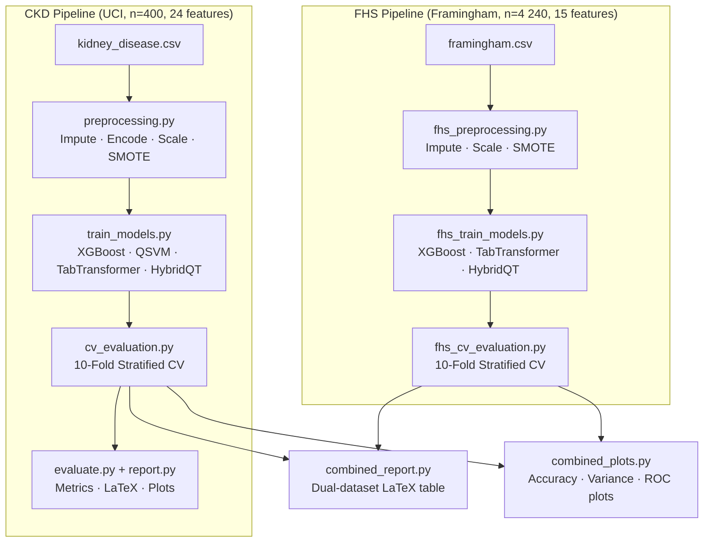
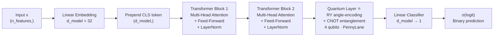
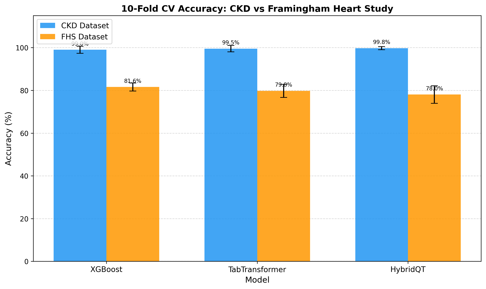
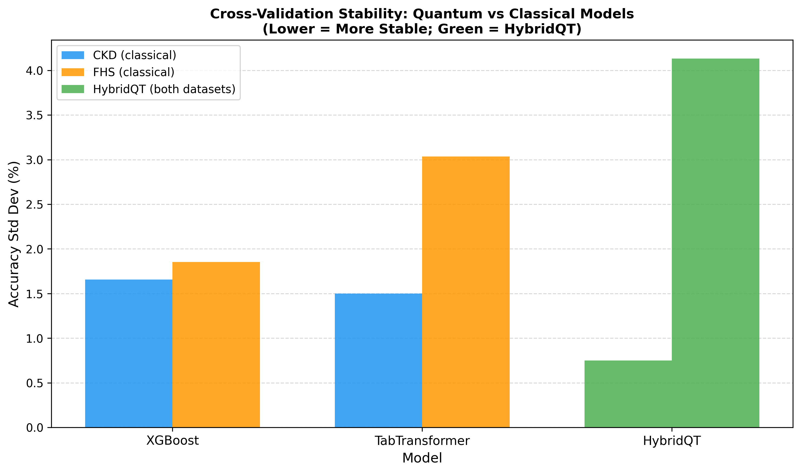
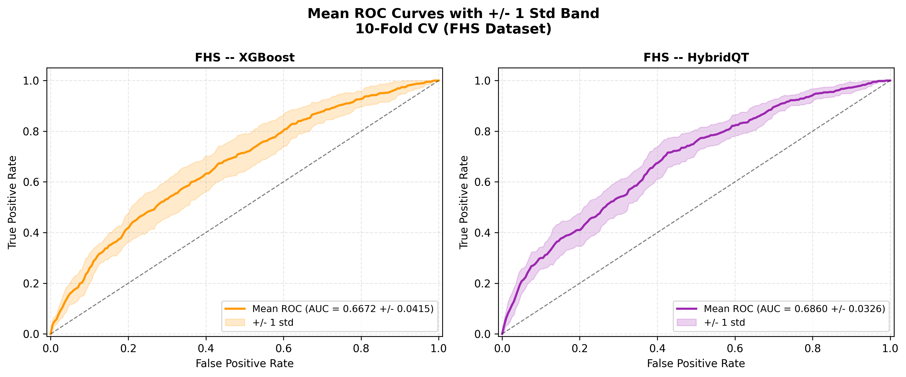

# Hybrid Quantum-Classical Transformer (HQCT)
### Dual-Dataset Validation: UCI CKD & Framingham Heart Study

> **QIP 2027 submission** — A hybrid quantum-classical architecture combining a classical TabTransformer with a variational quantum circuit (VQC) layer for medical binary classification.

---

## Overview

This repository implements and evaluates four models across two independent medical datasets:

| Model | Type |
|---|---|
| **XGBoost** | Classical gradient boosting (baseline) |
| **QSVM** | Quantum kernel SVM (RY+CNOT, 4 qubits) |
| **TabTransformer** | Classical attention-based tabular model |
| **HybridQT** | Hybrid quantum-classical transformer ← *proposed* |

Both pipelines use **10-fold stratified cross-validation with per-fold SMOTE** (no data leakage) and **McNemar's exact test** for statistical comparison.

---

## Architecture

### Pipeline Overview



### HybridQT Model Architecture



**Quantum layer detail:**
- CLS token (32-dim) → PCA to 4 dimensions → RY rotation encoding
- Entanglement: CNOT ladder (q0→q1→q2→q3)
- Measurement: ⟨Z⟩ on each qubit → 4-dim output appended to CLS
- Trainable: rotation angles θ (variational parameters)

---

## Results

### CKD Dataset (UCI, n=400)

| Model | Accuracy | F1 | AUC |
|---|---|---|---|
| XGBoost | 99.00% ± 1.66% | 99.19% ± 1.36% | 0.9987 |
| TabTransformer | 99.50% ± 1.50% | 99.60% ± 1.20% | 0.9992 |
| **HybridQT** | **99.75% ± 0.75%** | **99.80% ± 0.61%** | **0.9987** |

McNemar's test (HQCT vs XGBoost): **p = 0.375 — NOT significant** (comparable performance, HQCT lower variance).

### Framingham Heart Study Dataset (n=4,240)

| Model | Accuracy | F1 | AUC |
|---|---|---|---|
| **XGBoost** | **81.58% ± 1.85%** | 24.85% ± 5.04% | 0.6672 |
| TabTransformer | 79.76% ± 3.04% | 29.77% ± 5.47% | 0.6971 |
| **HybridQT** | 78.04% ± 4.13% | **31.12% ± 8.23%** | 0.6860 |

McNemar's test (HQCT vs XGBoost): **p ≈ 0 — SIGNIFICANT** (XGBoost better accuracy on harder imbalanced task; HQCT achieves best F1/recall).

### Combined Comparison Plots

| | |
|---|---|
|  |  |
| Accuracy ± std per model/dataset | Cross-validation stability |



---

## Installation

```bash
pip install torch pennylane xgboost scikit-learn imbalanced-learn \
            pandas numpy matplotlib joblib statsmodels
```

Python 3.9+ required. Tested on CPU; GPU is supported by PyTorch but not required.

> **Note:** QSVM training is very slow on CPU (hours). Use `--skip-qsvm` for fast runs.

---

## Datasets

### CKD — UCI Chronic Kidney Disease
- Download from [UCI ML Repository](https://archive.ics.uci.edu/ml/datasets/Chronic_Kidney_Disease)
- Place as: `data/kidney_disease.csv`
- n=400, 24 features, binary target `class` (ckd/notckd)

### FHS — Framingham Heart Study
- Download from [Kaggle](https://www.kaggle.com/datasets/aasheesh200/framingham-heart-study-dataset)
- Place as: `data/framingham.csv`
- n=4,240, 15 features, binary target `TenYearCHD`

---

## Usage

### CKD Pipeline (Steps 1–7)

```bash
# Run all 7 CKD steps in sequence
python main.py [--skip-qsvm] [--cv-epochs 50]

# Or run individual steps
python preprocessing.py          # Step 1: preprocess + SMOTE
python train_models.py           # Step 2: train all models
python cv_evaluation.py          # Step 3: 10-fold CV
python evaluate.py               # Step 4: test-set evaluation
python report.py                 # Step 5: metrics + LaTeX table
```

### FHS Pipeline (Steps FHS-1 through FHS-5)

```bash
# Run all FHS steps in sequence
python main_fhs.py [--skip-qsvm] [--cv-epochs 50]

# Or run individual steps
python fhs_preprocessing.py                        # FHS-1
python fhs_train_models.py [--skip-qsvm]           # FHS-2
python fhs_cv_evaluation.py [--skip-qsvm] \        # FHS-3
    [--cv-epochs 50] [--hqct-subsample 800]
python combined_report.py                          # FHS-4: dual LaTeX table
python combined_plots.py                           # FHS-5: comparison plots
```

### Key Flags

| Flag | Default | Description |
|---|---|---|
| `--skip-qsvm` | off | Skip QSVM (hours on CPU — skip for fast runs) |
| `--cv-epochs` | 50 | Epochs per fold for neural models |
| `--hqct-subsample` | 800 | Max training samples/fold for HybridQT (FHS only; 0 = no limit) |

---

## Output Files

```
results/
  cv_results.csv                  CKD 10-fold CV metrics (all models)
  fhs_cv_results.csv              FHS 10-fold CV metrics
  mcnemar_result.txt              CKD McNemar test (HQCT vs XGBoost)
  fhs_mcnemar_result.txt          FHS McNemar test
  combined_latex_table.tex        Dual-dataset booktabs table (paper-ready)
  combined_summary.txt            Abstract + venue notes + quantum advantage argument
  dual_accuracy_comparison.png    Grouped bar chart: CKD vs FHS accuracy
  dual_variance_comparison.png    Std dev comparison (HybridQT stability)
  dual_roc_curves.png             Mean ROC ± std band per model/dataset
  confusion_matrices.png          CKD per-model confusion matrices
  roc_curves.png                  CKD per-model ROC curves
```

---

## Repository Structure

```
.
├── main.py                        CKD orchestrator (Steps 1–7)
├── main_fhs.py                    FHS orchestrator (Steps FHS-1–5)
│
├── preprocessing.py               CKD: impute, encode, scale, SMOTE
├── train_models.py                CKD: train XGBoost/QSVM/TabTransformer/HybridQT
├── cv_evaluation.py               CKD: 10-fold stratified CV + McNemar
├── evaluate.py                    CKD: held-out test evaluation
├── report.py                      CKD: metrics report + LaTeX table
│
├── fhs_preprocessing.py           FHS: impute, scale, SMOTE
├── fhs_train_models.py            FHS: train models (n_features=15)
├── fhs_cv_evaluation.py           FHS: 10-fold CV + McNemar + proba export
├── combined_report.py             Dual-dataset LaTeX table + summary
├── combined_plots.py              3 publication-quality comparison plots
│
├── models/
│   ├── tab_transformer.py         Classical TabTransformer (PyTorch)
│   ├── hybrid_quantum_transformer.py   HybridQT: TabTransformer + VQC (PennyLane)
│   └── baselines.py               QSVM kernel builder
│
├── data/                          (gitignored — download separately)
│   ├── kidney_disease.csv
│   └── framingham.csv
│
└── results/                       Generated outputs (CSVs, PNGs, LaTeX)
```

---

## Reproducibility

All random seeds fixed to **42** throughout:
- `numpy.random.seed(42)`
- `torch.manual_seed(42)`
- `SMOTE(random_state=42)`
- `StratifiedKFold(random_state=42)`
- `XGBClassifier(random_state=42)`

SMOTE is applied **only inside each training fold** — never on validation or test sets — preventing data leakage.

---

## Citation

```bibtex
@misc{hqct2026,
  title   = {Hybrid Quantum-Classical Transformer for Medical Tabular Classification:
             Dual-Dataset Validation on CKD and Framingham Heart Study},
  author  = {Nafis},
  year    = {2026},
  note    = {Submitted to QIP 2027}
}
```
